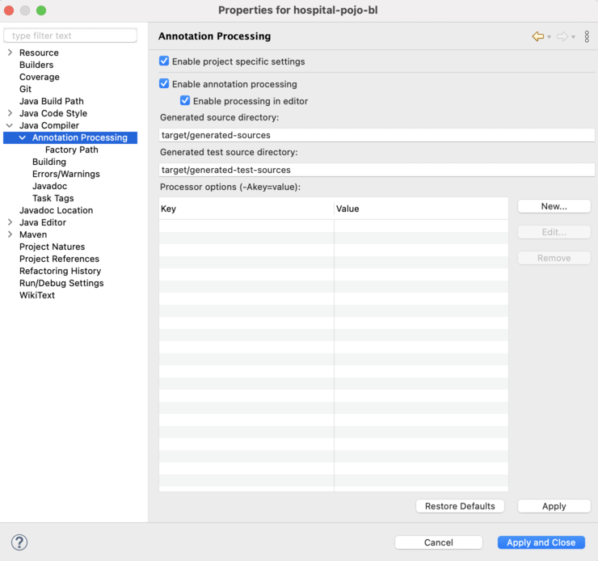

## Annotation Processor
Follow instructions below for installing the annotation processor in Eclipse IDE.

0. Download the jar file.

1. Select a project that you will be installing the annotation processor for (PROJECT\_NAME-pojo-bl).

2. Open *Properties* menu.

3. Go to *Java Compiler* > *Annotation Processing*. Enable annotation processing and enter the names for generated sources directories (with respect to the base directory of the project)

4. Go to *Factory Path*. Add the downloaded jar by clicking *Add External JARs* and selecting it.

5. Lastly, add `target/generated-sources` directory to the build path of the project. This can be done by right-clicking on the directory in the Package Explorer in Eclipse and selecting *Build Path* > *Use as Source Folder*.

