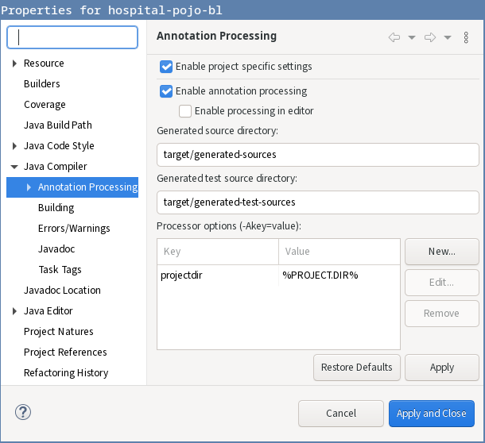
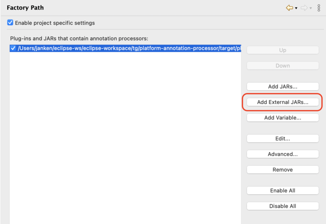

# Meta-model Annotation Processor

## Building
Prebuilt jar can be found [here](https://github.com/homedirectory/semantic-analysis/blob/master/processor/platform-annotation-processors-1.4.6-SNAPSHOT.jar).

1. Checkout the `Issue-#849` branch.
2. Step into `platform-annotation-processors` and do `mvn clean install`. The processor is now installed into the local repository and the jar is built in the `target` directory.

Alternatively, you can install the processor from the prebuilt jar:

```bash
mvn install:install-file -Dfile=platform-annotation-processors-1.4.6-SNAPSHOT.jar -DgroupId=fielden -DartifactId=platform-annotation-processors -Dversion=1.4.6-SNAPSHOT -Dpackaging=jar
```

## Maven dependency
Add the processor as a maven dependency to your project (in the `{PROJECT}-pojo-bl` module):

```xml
<dependency>
  <groupId>fielden</groupId>
  <artifactId>platform-annotation-processors</artifactId>
  <version>1.4.6-SNAPSHOT</version>
</dependency>
```

You should also include the following configuration of `maven-compiler-plugin` to ensure correct location of the generated meta-models when building with maven.

```xml
<plugin>
  <artifactId>maven-compiler-plugin</artifactId>
  <version>3.8.1</version>
  <configuration>
    <encoding>UTF-8</encoding>
    <generatedSourcesDirectory>${project.build.directory}/generated-sources/</generatedSourcesDirectory>
    <annotationProcessors>
      <annotationProcessor>
        ua.com.fielden.platform.processors.metamodel.MetaModelProcessor
      </annotationProcessor>
    </annotationProcessors>
  </configuration>
</plugin>
```


## Eclipse configuration
0. Get the processor jar.

1. Open Eclipse and select the project that you will be installing the annotation processor for (`{PROJECT}-pojo-bl`).

2. Select the project in the Package Explorer and open the `Properties` menu.

3. Go to `Java Compiler > Annotation Processing`. Enable annotation processing and enter the names for generated sources directories (with respect to the base directory of the project)

4. Set `Processor options` for comprehensive logging.

    Go to `Java Compiler > Anotation Processing` menu. Under `Processor options` select `New...` and input the following:
  
    Key: `projectdir` & Value: `%PROJECT.DIR%`
    
    Note: This step is necessary, since there are issues with Eclipse writing a log file using `log4j` when running an annotation processor. 


    

5. Go to `Factory Path`. Add the jar by clicking `Add External JARs` and selecting the file.

    

6. Add `target/generated-sources` directory to the build path of the project. This can be done by right-clicking on the `target/generated-sources` directory in the Package Explorer in Eclipse and selecting `Build Path > Use as Source Folder`.

    Note: This step might be completed automatically by Eclipse.


## Usage
To get started, clean (rebuild) the project that you added the processor to in Eclipse (either with maven or Eclipse). You should see `target/generated-sources` get populated with the generated meta-models.

* For each entity annotated with `@MapEntityTo` or `@DomainEntity` (annotation that is included with the processor jar) there will be a meta-model generated that captures all fields annotated with `@IsProperty`. Take note of the generated javadoc for each property.
* A class named `metamodels.MetaModels` will be generated that contains an instance of each active meta-model as a static field. This sole class should be used to reference any meta-model.
* Whenever a metamodeled entity class is edited and saved, thus compiled, its meta-model and all related ones will be regenerated to reflect the latest changes. Renaming and deletion of an entity is also covered.
* If an entity should no longer be metamodeled, that is, it is either no longer annotated with the above mentioned annotations or renamed or deleted, then its meta-model is regenerated into inactive one - an abstract empty class. The corresponding field of `metamodels.MetaModels` is removed. The automatic deletion of a meta-model is not supported at the moment.

The properties of an entity in a generated meta-model are accessed by methods with according names. The return type of such a method is a class implementing the `IConvertableToPath` interface that declares one method --- `String toPath()`, which returns a `String` representing the captured dot-notation. Also note that `toString()` is equivalent to `toPath()`.

### Example
```java
public interface PersonCo extends IEntityDao<Person> {
    static final PersonMetaModel person = MetaModels.Person;
    
    static final IFetchProvider<Person> FETCH_PROVIDER = EntityUtils.fetch(Person.class).with(
            // non-entity property type
            person.name().toPath(),                         // "name"
            person.key().toPath(),                          // "key"

            // entity property type
            person.vehicle().toPath(),                      // "vehicle"
            person.vehicle().insurance().toPath()           // "vehicle.insurance"
            person.vehicle().insurance().number().toPath()  // "vehicle.insurance.number"

            // absence of context
            person.toPath()                                 // "this"
            );
}
```

Simplified domain schema:
```java
@MapEntityTo
public class Person extends ActivatableAbstractEntity<DynamicEntityKey> {
    @IsProperty
    private String name;

    @IsProperty
    private Vehicle vehicle;
}

@DomainEntity
public class Vehicle extends ActivatableAbstractEntity<DynamicEntityKey> {
    @IsProperty
    private Insurance insurance;
}

// either annotation works
@DomainEntity
@MapEntityTo
public class Insurance extends ActivatableAbstractEntity<DynamicEntityKey> {
    @IsProperty
    private Long number;
}
```

Lastly, the class of an underlying entity can be obtained from the meta-model using `getEntityClass()`.


