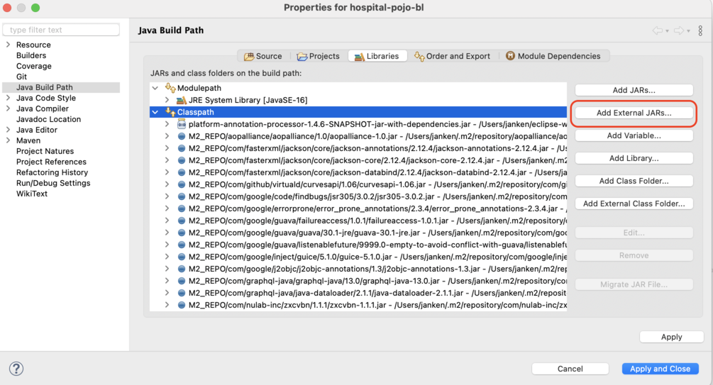

# Annotation Processor

## Building
Prebuilt jar can be found [here](https://github.com/homedirectory/semantic-analysis/blob/master/processor/platform-annotation-processor-metamodel-1.4.6-SNAPSHOT.jar).

### Installing the processor to local maven repository
You can install the processor from the prebuilt jar:

```bash
mvn install:install-file -Dfile=platform-annotation-processor-metamodel-1.4.6-SNAPSHOT.jar -DgroupId=fielden -DartifactId=platform-annotation-processor-metamodel -Dversion=1.4.6-SNAPSHOT -Dpackaging=jar
```

## Maven dependency
Add the processor as a maven dependency to your project (`{PROJECT}-pojo-bl`):
```
<dependency>
  <groupId>fielden</groupId>
  <artifactId>platform-annotation-processor-metamodel</artifactId>
  <version>1.4.6-SNAPSHOT</version>
</dependency>
```

You should also include the following configuration of `maven-compiler-plugin` to ensure correct location of the generated meta-models when building with maven.
```
<plugin>
  <artifactId>maven-compiler-plugin</artifactId>
  <version>3.8.1</version>
  <configuration>
    <encoding>UTF-8</encoding>
    <generatedSourcesDirectory>${project.build.directory}/generated-sources/</generatedSourcesDirectory>
    <annotationProcessors>
      <annotationProcessor>
        ua.com.fielden.platform.processors.metamodel.MetaModelProcessor
      </annotationProcessor>
    </annotationProcessors>
  </configuration>
</plugin>
```


## Eclipse configuration
0. Get the prebuilt jar.

1. Open Eclipse and select the project that you will be installing the annotation processor for (`{PROJECT}-pojo-bl`).

2. Select the project in the Package Explorer and open the `Properties` menu.

3. Go to `Java Compiler > Annotation Processing`. Enable annotation processing and enter the names for generated sources directories (with respect to the base directory of the project)

4. Set `Processor options` for comprehensive logging.

    Go to `Java Compiler > Anotation Processing` menu. Under `Processor options` select `New...` and input the following:
  
    Key: `projectdir` & Value: `%PROJECT.DIR%`
    
    Note: This step is necessary, since there are issues with Eclipse writing a log file (using `log4j`) when running an annotation processor. 


    

5. Go to `Factory Path`. Add the downloaded jar by clicking `Add External JARs` and selecting the file.

    

6. Add `target/generated-sources` directory to the build path of the project. This can be done by right-clicking on the project in the Package Explorer in Eclipse and selecting `Build Path > Use as Source Folder`.

    Note: This step might be completed automatically by Eclipse.

7. Lastly, you might (but most likely not) need to include the processor jar as a library dependency in Eclipse.

    Select your project in the `Package Explorer` and open `Properties` menu. Then go to `Java Build Path > Libraries` and select `Add External JARs`.

    

