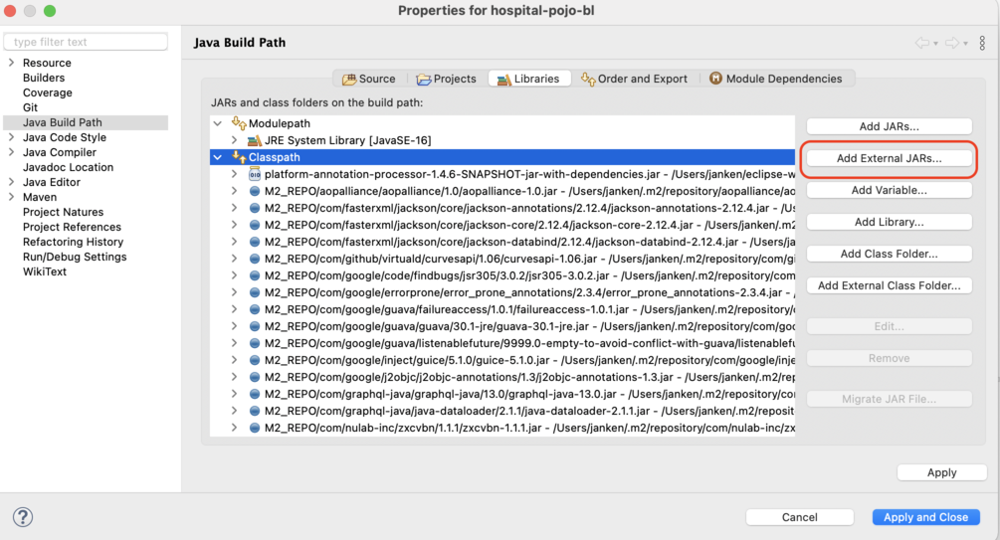

# Annotation Processor

## Building
Prebuilt jar can be found [here](https://github.com/homedirectory/semantic-analysis/blob/master/processor/platform-annotation-processor-1.4.6-SNAPSHOT-jar-with-dependencies.jar).

Alternatively you can build the latest development version:

1. Checkout the branch `Issue-#849` (https://github.com/fieldenms/tg/tree/Issue-%23849).

2. Build the `platform-annotations` module:
```
cd platform-annotations
mvn clean compile
```

3. Build the processor:
```
cd platform-annotation-processor
mvn clean compile assembly:single
```

The last command uses the `maven-assembly-plugin` and creates a jar with all dependencies bundled inside at `target/platform-annotation-processor-1.4.6-SNAPSHOT-jar-with-dependencies.jar`

### Installing the processor to local maven repository
You can install the processor either by building the latest version or by installing from the prebuilt jar.

1. Building the latest version:

    a. Checkout the branch `Issue-#849` (https://github.com/fieldenms/tg/tree/Issue-%23849).

    b. Install the `platform-annotations` module:
    ```
    cd platform-annotations
    mvn clean install
    ```

    c. Install the processor:
    ```
    cd platform-annotation-processor
    mvn clean install
    ```

2. Installing from the prebuilt jar:

```bash
mvn install:install-file -Dfile=platform-annotation-processor-1.4.6-SNAPSHOT-jar-with-dependencies.jar -DgroupId=fielden -DartifactId=platform-annotation-processor -Dversion=1.4.6-SNAPSHOT -Dpackaging=jar
```

## Maven dependency
Modify `pom.xml` file of your project by including the following:
```
<dependency>
  <groupId>fielden</groupId>
  <artifactId>platform-annotation-processor</artifactId>
  <version>1.4.6-SNAPSHOT</version>
</dependency>
```

```
<build>
  <plugins>
    <plugin>
      <artifactId>maven-compiler-plugin</artifactId>
      <version>3.8.1</version>
      <configuration>
        <source>16</source>
        <target>16</target>
        <encoding>UTF-8</encoding>
        <generatedSourcesDirectory>${project.build.directory}/generated-sources/</generatedSourcesDirectory>
        <annotationProcessors>
          <annotationProcessor>
            ua.com.fielden.platform.processors.meta_model.MetaModelProcessor
          </annotationProcessor>
        </annotationProcessors>
      </configuration>
    </plugin>
  </plugins>
</build>
```


## Eclipse configuration
0. Get the prebuilt jar or build it yourself as instructed above.

<br>


1. Open Eclipse and select the project that you will be installing the annotation processor for (`[PROJECT]-pojo-bl`).

<br>


2. Select the project in the Package Explorer and open the *Properties* menu.

<br>


3. Go to *Java Compiler > Annotation Processing*. Enable annotation processing and enter the names for generated sources directories (with respect to the base directory of the project)

    

<br>

4. Go to *Factory Path*. Add the downloaded jar by clicking *Add External JARs* and selecting the file.

    

<br>

5. Set *Processor options* for comprehensive logging.

    Go to *Java Compiler > Anotation Processing* menu. Under *Processor options* select *New...* and input the following:
  
    Key: `projectdir` & Value: `%PROJECT.DIR%`
    
    <br>    
    
    *Note:* This step is necessary, since there are issues with Eclipse running the annotation processor using log4j. 

<br>

6. Add `target/generated-sources` directory to the build path of the project. This can be done by right-clicking on the project in the Package Explorer in Eclipse and selecting *Build Path > Use as Source Folder*.

    <br>

    *Note:* This step might be completed automatically by Eclipse.
    
<br>

7. Lastly, you might need to include the jar as a *library dependency in Eclipse*.

    Select your project in the *Package Explorer* and open *Properties* menu. Then go to *Java Build Path > Libraries* and select *Add External JARs*.

    

